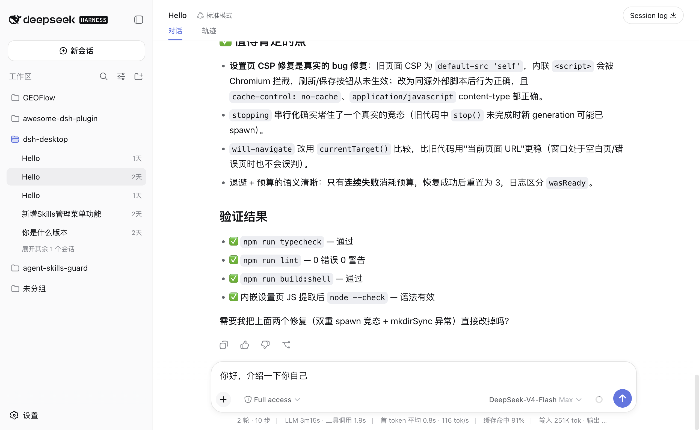
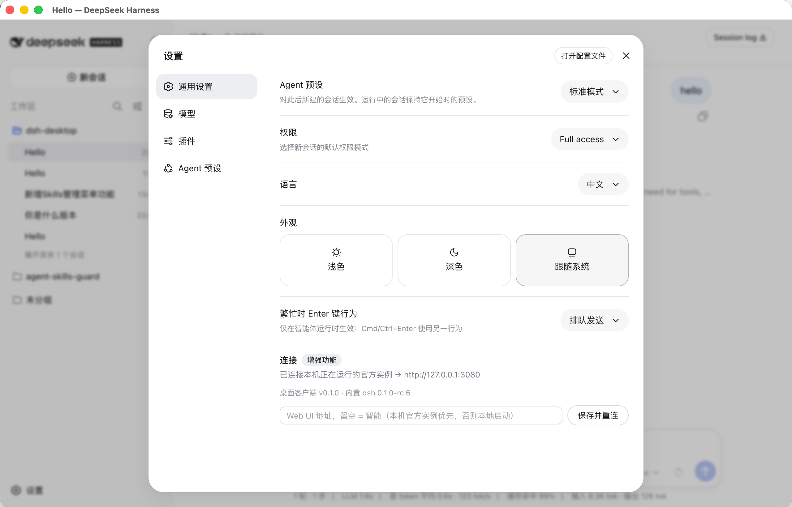

# DeepSeek Harness Desktop

[中文](README.md) | English

**Put DeepSeek Harness on your desktop as-is: the official Web UI itself, day-zero official features.**

DeepSeek Harness Desktop is an independent Electron client for `dsh`. It starts or connects to the official `dsh Web UI` and displays that UI directly in a focused native window, so you get the complete Harness experience without keeping another browser tab open. It is not a look-alike and not a rewrite — what you see is the official product itself.

> [!IMPORTANT]
> **This is an unofficial, community-maintained third-party project.** It is not developed, published, endorsed, or supported by DeepSeek and does not represent DeepSeek. `DeepSeek`, `DeepSeek Harness`, `dsh`, and related names, logos, and trademarks belong to their respective owners. Report desktop-client issues to this repository, not to DeepSeek support.

Release packages bundle a pinned version of the official `@deepseek-ai/dsh` runtime. End users do not need to install Node.js, pnpm, or the `dsh` CLI separately. The desktop shell, installers, connection enhancements, and release signatures are independently maintained by this project and are not part of the official runtime.

The desktop client and official `dsh` use independent version numbers; there is no required correspondence between them. The connection settings page displays both the desktop version and the bundled dsh version for compatibility diagnostics.



## Why use the desktop client?

Start from what Harness actually is. Its value is the official product itself: the official UI and runtime keep evolving quickly, and that is exactly what users want — unchanged, in one focused desktop window. Rather than writing another interface and re-doing every new official feature by hand, the window simply shows the official interface itself. And what users ask for is a *desktop*, not *another app*: a focused window, tray persistence, system integration, and an execution environment suited to long-running work.

So this project does exactly one thing: **put the official Web UI as-is into a native window, and spend all engineering effort on the connection layer, security, the execution environment, and the desktop experience — tray persistence, launch-and-go, smart connection, in-app updates.** The benefits of this approach hold on their own:

| What users need | Our design choice |
|---|---|
| All of Harness's capabilities, nothing missing | The window shows the official Web UI itself — no interface rewrite |
| Day-zero official features | Delivery is decoupled from our own releases: Smart mode reuses the newest `dsh` you already have; the bundled runtime is only a fallback |
| Works out of the box, no environment setup | The installer carries the official runtime: no Node.js to install, no commands to type — launch and go |
| Security and privacy are the baseline | A small boundary plus layered hardening: public interfaces only; an unhijackable update path; least-privilege permissions |
| The Agent runs in *your* environment | Your running instance / PATH `dsh` / npx-cached package come first; macOS login-shell `PATH` alignment; `node` is always available |
| Work continues across terminal, desktop, and remote machines | Smart mode shares `~/.dsh` with the CLI and browser; Pinned address connects to a remote `dsh` |
| Long tasks are not hostage to a browser tab | Closing the window does not quit the app; it stays in the tray |

And here is what that means in the product:

- **Day-zero official features.** The window loads the official Web UI itself, not a look-alike. When the official interface adds features or changes interactions, the official docs, tutorials, and shortcuts all match exactly — no "the tutorial shows something your screen doesn't". When the official project ships, upgrade the `dsh` you already have (or let the in-app update push the bundled runtime) and the desktop client follows with zero changes and zero waiting.
- **Launch and go — no command line required.** The installer carries the official runtime: no Node.js or pnpm to install, no commands to type, and first launch is just entering an API key. For newcomers that is the whole story; if you do know the command line, Smart mode and Pinned address are right there when you want them.
- **Security is a point we take seriously.** The client speaks only the public `dsh web` interface and never touches the official repo's internals; the window runs sandboxed with Node integration disabled and navigation locked to the official origin; in packaged builds the update source and data directories cannot be hijacked via environment variables; the renderer gets only clipboard and fullscreen permissions; external links always open in the system browser. See [Security and privacy](#security-and-privacy).
- **Smart mode reuses the instance you are already running.** It probes in order: the official instance on `127.0.0.1:3080` → a `dsh` on PATH → an npx-cached package → the bundled runtime. Browser, CLI, and desktop then share one live Harness process, with sessions synced in real time and the Agent running inside your own complete shell environment.
- **Pinned address connects to a `dsh` anywhere.** Another machine, a container, or a runtime you maintain: enter its address and connect directly. The client starts no runtime of its own — version, plugins, and environment stay entirely under your control.
- **Transparent runtime status.** Five statuses describe exactly who started the runtime (reusing yours / bundled / npx-cached / installed / pinned address), and the client shows both its own version and the bundled dsh version, so troubleshooting never involves guessing.
- **An engineered Agent execution environment.** On the bundled runtime: users without Node.js still get an Agent that can run `node`; `ELECTRON_RUN_AS_NODE` never leaks into Agent commands (otherwise Electron-based tools like `code` would fail); launching from Finder or the Dock still finds Homebrew, `~/.local/bin`, and tools exported from `~/.zshrc`. See [The Agent's execution environment on the bundled runtime](#the-agents-execution-environment-on-the-bundled-runtime).
- **In-app updates with SHA-256 verification.** Packaged builds check GitHub Releases on launch (at most once every 12 hours), verify the download hash, then install.
- **A self-checking release pipeline.** An empty-PATH package smoke test (the artifact must really use its bundled runtime), an update-feed fixture, runtime-environment isolation checks, the Win32 picker patch, and a real-request e2e run — a set of gates that rejects artifacts that build but don't work. See [Development](#development).

## FAQ

**Q: Is this a browser wrapper, or a rewrite on the SDK?**

Neither: the window loads the official Web UI itself, but the client is not just "a web page in a frame" — runtime startup and reuse, connection management, window and navigation hardening, the tray, and in-app updates all live in the shell layer, and this repository maintains no second product renderer (trade-offs and rejected alternatives are documented in the [architecture notes](docs/desktop-client-architecture.md)). Desktop clients in the DeepSeek Harness ecosystem mostly take one of three routes; this project chose the third:

| Route | Approach | Structural cost |
|---|---|---|
| ① Self-built workbench UI (e.g. [RongleCat/deepseek-app](https://github.com/RongleCat/deepseek-app)) | The Harness engine runs inside the app; the interface is a self-built three-column workbench, not the official Web UI | Every new feature of the official product surface has to be re-implemented in that UI |
| ② Packaging wrapper (e.g. [anywhere-labs/deepseek-harness-desktop](https://github.com/anywhere-labs/deepseek-harness-desktop)) | Builds a desktop client on top of the official repository, covering service lifecycle, window and tray integration, UI adaptation, and installer releases | Official updates require merging upstream and cutting a new release before they can follow |
| ③ Native direct-connect (this project) | The window loads the official Web UI directly; engineering goes into connection, security, the execution environment, and the desktop experience | No self-built UI; desktop enhancements are bounded by what the official interface can carry |

**Q: What's the main value for users?**

1. **It works as installed**: the installer carries the official runtime — no Node.js, pnpm, or `dsh` CLI to install, one API key and you're chatting; the app stays in the tray and closing the window does not quit it;
2. **It reuses the `dsh` you're already running**: Smart mode probes the running official instance, a `dsh` on PATH, then an npx-cached package — terminal, browser, and desktop share one Harness process and one `~/.dsh`, with sessions synced in real time; Pinned address mode connects straight to a remote or containerized instance;
3. **The authentic official experience**: the window is the official Web UI, so official docs, tutorials, and shortcuts all match. After an official release, Smart mode and Pinned address get it day zero; the bundled runtime follows via in-app updates.

**Q: How is this different from just using a browser — besides not installing Node.js?**

The official browser path is: install Node.js, run `npx @deepseek-ai/dsh web`, then open the address it prints — and when that terminal closes, the service stops. The client turns this into a managed setup: the installer carries the runtime and launches with a double-click; closing the window does not quit the app, which stays in the tray; Smart mode first probes the instance you're already running, then starts a background service from a `dsh` on PATH or an npx-cached package, and only falls back to its bundled runtime; on top of that come in-app updates and transparent display of the connection source and versions, which a plain browser tab does not have.

**Q: Why emphasize "day-zero official features"?**

A client with a self-built UI or modified source has to re-implement, or merge upstream and re-release, before it can follow an official update; this project's window loads the official Web UI directly, so whatever the official interface changes into is what the window shows. Along the update paths specifically: Smart mode reuses the `dsh` you already upgraded, and Pinned address connects to the newest instance you maintain — both are available the day the official project ships; the bundled runtime is pinned to the official version locked at release time and follows via in-app updates, slightly behind the official release.

**Q: Will plugins come later? What else is planned?**

Capabilities of the official Web UI itself (skills, plugins, interactions) need no schedule from this project — they appear in the window as the official project ships. Work on the desktop shell itself is listed in [Project status](#project-status) and [TODO](TODO.md): macOS/Windows signing and notarization, system notifications, OS keychain integration, voice input, an independent update channel for the bundled runtime, and periodic probing of newly appeared instances.

## Quick start

### Download a release

Download the package for your system from [GitHub Releases](https://github.com/bruc3van/dsh-desktop/releases) and launch it. Release builds include the official `dsh` runtime, require no development tools, and do not run an npm install on first launch.

Automated packages are currently unsigned on macOS and Windows. The operating system may show a first-launch security warning; until signing and notarization are configured, this remains a known limitation of the "download and run" experience. Download only from this repository and verify the included `SHA256SUMS.txt`.

#### If the operating system blocks the first launch

- **macOS:** Current packages are not yet signed and notarized with an Apple Developer ID. Download the DMG only from this repository's Release and first verify its SHA-256 in Terminal:

  ```sh
  cd ~/Downloads
  shasum -a 256 dsh-desktop-*.dmg
  ```

  Compare the output with the matching file in `SHA256SUMS.txt` from the same Release. If it matches, drag the app to **Applications**, double-click it once, then open **System Settings → Privacy & Security** and choose **Open Anyway** in the Security section. Enter your login password when prompted. The button is available only for a limited time after the launch attempt. See [Apple's official instructions](https://support.apple.com/guide/mac-help/open-a-mac-app-from-an-unknown-developer-mh40616/mac).

  If macOS still says the app is damaged and **Open Anyway** is unavailable, run the following only after the SHA-256 has been verified:

  ```sh
  xattr -dr com.apple.quarantine "/Applications/DeepSeek Harness Desktop.app"
  open "/Applications/DeepSeek Harness Desktop.app"
  ```

  This removes the download quarantine attribute only from this app. It does not disable Gatekeeper globally and does not require `sudo`. If the checksum does not match, delete the file and download it again instead of running the command.
- **Windows:** If Microsoft Defender SmartScreen shows a protection prompt, first verify the download source and SHA-256 checksum. Then choose **More info → Run anyway** only if they match.

### Run from source

Source development requires Node.js `^22.19.0 || >=24.0.0` and [pnpm](https://pnpm.io/). A separate `dsh` installation is not required.

```sh
git clone https://github.com/bruc3van/dsh-desktop.git
cd dsh-desktop
pnpm install
pnpm run dev
```

On launch, **Smart mode** picks a runtime in this order:

1. It checks `http://127.0.0.1:3080`. If an official Web UI is already running there, the desktop client connects to it. The browser and desktop app then share one live Harness process.
2. If nothing answers, it looks for a `dsh` you already installed on PATH (a working `dsh --version` is the whole test).
3. Then it looks for a copy npx has already cached. **The official instruction, `npx @deepseek-ai/dsh web`, installs nothing onto PATH** — it leaves the complete package in npm's cache (`~/.npm/_npx/` on POSIX, `%LOCALAPPDATA%\npm-cache\_npx\` on Windows). Running it once is enough for the client to reuse it.
4. Only if none of those exist does it use the pinned official runtime bundled in the installer or project dependencies.

Steps 2 and 3 run on **your own Node** and use only packages that are **already present** — nothing is downloaded, and Node.js is never installed for you; an empty cache is simply skipped. The client reads the cached package's `package.json` to confirm it really is `@deepseek-ai/dsh` and to report its true version, so nothing else sitting at that path can be launched by mistake.

What gets started is always a plain background service (`dsh web --port 0`) — not a browser window, and never on port 3080 — and the client shuts it down when you quit. If the chosen runtime fails to start, the client falls back to the bundled one automatically. Connection settings show which runtime is in use (installed / npx cache / bundled) and its version.

If the bundled runtime cannot start, or you want to use another instance, open the application menu and choose **Web UI Connection…**.

### First conversation

1. On first launch, enter your key in **Add an API key to get started**. You can also choose **Configure later** and return through **Settings → Models → DeepSeek**.
2. If you do not have a key, use **Create one on the DeepSeek platform** below the field; it opens <https://platform.deepseek.com/api_keys> in your system browser. The link is a desktop-client enhancement. DeepSeek manages the API account, balance, and usage charges.
3. Optionally choose a default Agent preset or model.
4. Add a project folder for workspace-aware tasks, or start a conversation directly.
5. Describe the outcome you want and send the message.

> [!TIP]
> With a fresh data directory, the official Web UI may initially appear in English. Use **Settings → General → Language** to switch languages.

## Two connection modes

The client serves two audiences, and both paths are first-class:

- **The bundled runtime** exists so the app works the moment it is installed. Releases carry a pinned official runtime; no Node.js, pnpm, or `dsh` CLI required.
- **Connecting to a full runtime you manage** exists for developers. Run `dsh web` in your own terminal — locally, on another machine, or in a container — and the desktop client is only the window onto it, leaving runtime version, plugins, and environment entirely under your control.

| Mode | Best for | Behavior |
|---|---|---|
| **Smart** (default) | Most local users | Tries in order: the official instance on `127.0.0.1:3080` → a `dsh` on PATH → an npx-cached official package → the bundled runtime. |
| **Pinned address** | Another machine, a container, or a manually managed runtime | Connects to the Web UI address you provide and starts no runtime of its own. |

In Smart mode, an official Web UI already running in your terminal is reused as-is — the developer path: sessions stay shared with the desktop window while the Agent runs inside your own complete shell environment.

Enter an address and choose **Save and connect** to store and use it immediately. While a pinned address is active, **Switch to Smart mode** is shown as a separate escape; the address remains saved, so **Save and connect** can use it again later.

Connection status is described by **who started the runtime**, so "local" and "bundled" no longer overlap:

| Status | Meaning |
|---|---|
| Reusing the dsh you started | An instance you ran yourself (`127.0.0.1:3080` by default) |
| Client-started · bundled runtime | A background child using the runtime shipped in the installer |
| Client-started · npx-cached dsh | A background child using the official package npx already cached |
| Client-started · installed dsh | A background child using the `dsh` you installed on PATH |
| Pinned address | A direct connection; the client starts no runtime |

> Choosing **Save and connect** for `127.0.0.1:3080` — the default probe address — keeps the client in Smart mode. Smart already prefers that instance and can still fall back automatically when it stops.

Leave the Web UI address empty to return to Smart mode. Connection settings can be changed from the enhanced block in General Settings or from **Web UI Connection…** in the application menu.



> [!TIP]
> For a remote instance, use a trusted network and HTTPS where available. The configured address is a direct connection target, not a relay operated by this project.

## Security and privacy

The desktop shell and the Harness runtime keep separate responsibilities:

| Data | Default location | Owner |
|---|---|---|
| Conversations, credentials, model configuration, and official Harness state | `~/.dsh` | Official `dsh` runtime |
| Desktop connection preference | `~/.dsh-desktop/settings.json` | Desktop client |

Override these locations with `DSH_HOME` and `DSH_DESKTOP_HOME` respectively.

The client's security strategy is a small boundary plus layered hardening:

- **A small boundary.** The client uses only the public `dsh web` CLI and `/api` contract. It does not patch the official repository or import private Harness internals.
- **Window hardening.** The Electron window runs with context isolation and sandboxing enabled, Node integration disabled, navigation restricted to the configured Web UI origin, and external links opened in the system browser.
- **An update path that cannot be hijacked.** In packaged builds, the update source and GitHub API addresses, the data directories (`DSH_HOME`, `DSH_DESKTOP_HOME`), and the connection-probe switch cannot be overridden by environment variables. The updater validates installer filenames in the update manifest against path traversal outside the download directory.
- **Least-privilege permissions.** Renderer permission requests are limited to clipboard writes and fullscreen; camera, microphone, and other device permissions are rejected. Unauthorized in-page navigation and new-window redirects are blocked; only trusted origins are allowed.

Use of this client remains subject to the terms and privacy policies of DeepSeek, model providers, and any connected service. Users and those services are responsible for API keys, model requests, charges, generated content, and Agent actions on local files or commands. The software is provided "as is" under the MIT License, without warranties of fitness, data preservation, service availability, model output, or third-party cost, except where applicable law requires otherwise.

## Desktop behavior

- Closing the main window keeps the app available in the system tray/menu bar.
- Reopen the window from the tray icon.
- Quit from the tray menu, application menu, or `Cmd+Q` on macOS.
- Packaged builds check GitHub Releases for a newer version a few seconds after launch (at most once every 12 hours). You can also check from **Settings → General → App updates**, the tray menu, or the macOS application menu. After you confirm, the client downloads the installer, verifies its SHA-256, and launches it. Unpackaged development builds do not auto-check.
- If the official `127.0.0.1:3080` instance reused by Smart mode disappears, the client falls back to its managed local `dsh web`. A failed fixed remote connection never switches to a local service implicitly.
- If a locally managed Web UI exits unexpectedly, the client performs a small number of bounded restart attempts instead of retrying forever.
- If the page is unexpectedly blank after system resume or a long idle, the client verifies the Web UI and reloads it automatically.
- Before starting the local service, the packaged macOS app reads the user's shell `PATH` once — an interactive login shell first (three-second deadline), falling back to a plain login shell (two seconds) — and merges only absolute directories. This keeps Homebrew, `~/.local/bin`, and directories exported from `~/.zshrc` available to Agents when the app starts from Finder or the Dock.

## The Agent's execution environment on the bundled runtime

On the bundled runtime the Agent's capabilities match official `dsh` — same runtime, same `~/.dsh`, same OS-level sandboxing. The execution environment is aligned with "running dsh in your own terminal" as follows:

- **`node` is always available.** Packaged builds publish Electron's own Node under the name `node` in `~/.dsh-desktop/bin` and **append** that directory to the runtime's `PATH`. A user who never installed Node still gets an Agent that can run `node script.js`; a user who did keeps their own version first. The directory provides no `npm`/`npx` — for those (starting an MCP server with `npx`, say) install Node.js or use Pinned address mode. The shim works by setting `ELECTRON_RUN_AS_NODE` so Electron runs as Node, so **processes started through it, and their own children,** carry that variable: a node script that goes on to launch an Electron-based tool must clear it, or use a real Node.js install.
- **The Agent's environment stays clean.** The bundled runtime relies on `ELECTRON_RUN_AS_NODE` to run on Electron's Node, which is an implementation detail of how it is launched. The client removes that variable once the runtime starts and re-attaches it only where the runtime itself respawns Node (the native folder picker, the Windows ACL sandbox runner), so the Agent's own commands never inherit it — otherwise every Electron-based tool the Agent runs (`code`, for instance) would fail.
- **File permissions.** The app does not enable the App Sandbox, so the Agent's file access is that of an ordinary user process. On macOS the first access to Desktop, Documents, or Downloads is prompted in this app's name, and grants are recorded per application — permissions already given to your terminal do not carry over. The system prompt states the purpose.
- **Pinned version.** The bundled runtime ships with the installer and cannot be upgraded on its own. To track the latest official release, use Pinned address mode with a runtime you maintain — this is the developer path to day-zero official features.

## Development

```sh
pnpm run build          # build the Electron main process and preload
pnpm run prepare:runtime # prepare the bundled dsh runtime closure
pnpm run check:picker   # verify the bundled Win32 picker compatibility patch
pnpm run check:runtime-env # verify the Agent environment does not inherit Electron's Node-mode variable
pnpm run dist           # build packages for the current platform
pnpm run typecheck      # TypeScript validation
pnpm run lint           # source and script linting
pnpm run check:updater  # verify in-app update check, hash, and dismiss
pnpm run audit          # boot and browser-surface smoke test
pnpm run smoke:package  # prove the packaged app uses its bundled dsh runtime
pnpm run shot           # refresh screenshots in shots/
pnpm run shot:readme    # refresh the privacy-safe README screenshots
pnpm run e2e            # send a real prompt and verify the streamed response
```

In addition, `scripts/` contains a family of regression checks for connection and runtime behavior: `check:connection` (mode switching), `check:installed-runtime` (installed runtime), `check:runtime-resolution` (runtime resolution), `check:auto-fallback` (loss-of-instance fallback), and `check:error-surface` (error UI).

`pnpm run e2e` needs a valid API key. The production window loads the official Web UI; this repository does not maintain a second product renderer. `pnpm run check:updater` drives a local update-feed fixture through check, hash verification, and dismiss.

For the process model, trust boundary, and design decisions, see [Desktop client architecture](docs/desktop-client-architecture.md).

## Releasing a version

To release a version, push its tag directly. GitHub Actions treats the tag as the single version source and writes it to `package.json` during the build:

```sh
git tag v0.2.0
git push origin v0.2.0
```

GitHub Actions validates the tag format, uses the tag as the release version, then builds:

- macOS Apple Silicon: DMG;
- macOS Intel: DMG;
- Windows x64: NSIS installer.

Linux packages are temporarily outside the automated release scope; the source-level cross-platform compatibility code remains in place.

After every platform succeeds, the workflow generates SHA-256 checksums and `latest.json` for the in-app updater, then creates or updates the matching GitHub Release. Tags containing prerelease identifiers such as `-rc` or `-beta` are marked as prereleases automatically and do not become the `/releases/latest` update feed.

## Project status

The desktop shell, Smart/Pinned address modes, shared `DSH_HOME`, tray behavior, runtime supervision, in-app updates, bundled official `@deepseek-ai/dsh`, macOS/Windows packaging, and tag-based release automation are implemented. The release workflow launches each packaged app with an empty PATH and probes its Web UI, preventing artifacts that accidentally omit the bundled runtime. Automated artifacts are still unsigned; macOS/Windows signing and notarization remain prerequisites for a warning-free general-user installation. Notifications, OS keychain integration, and voice input are also future work.

Contributions and issue reports are welcome, especially around Windows behavior, remote connections, and packaging.

## License

[MIT](LICENSE)

The MIT License covers only code and assets maintained in this repository. The bundled official `@deepseek-ai/dsh` runtime and other third-party dependencies remain under their own licenses. "DeepSeek Harness" is used in the project name only to identify the compatible product; it does not imply an official relationship.
